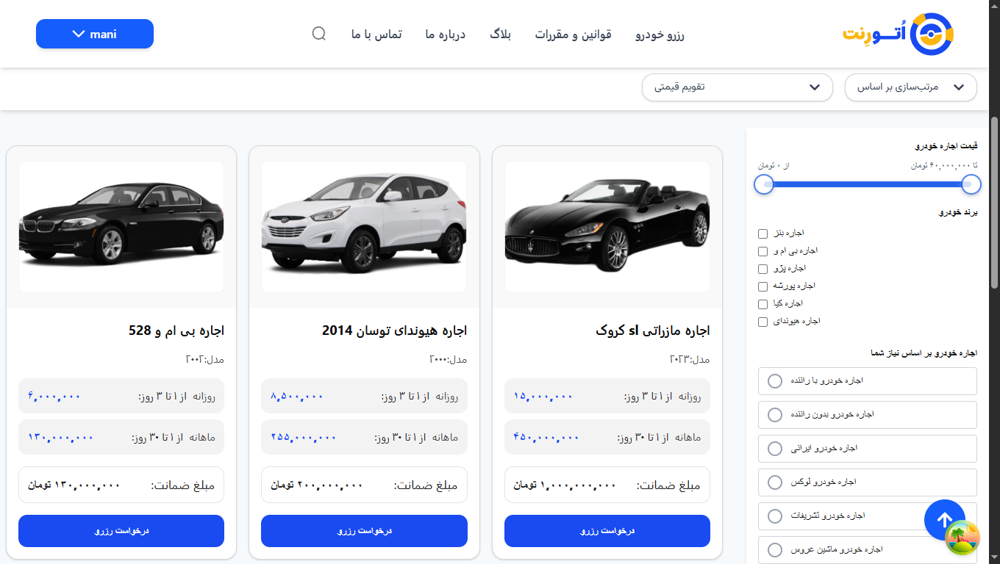
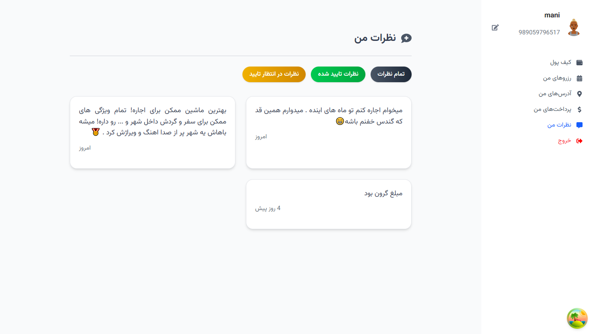

# Auto Rent


**یک وب‌اپلیکیشن جامع برای اجاره، مشاهده و مدیریت خودروهای اجاره‌ای**

## دموی آنلاین (Live Demo)

[🚀 مشاهده دموی پروژه](https://auto-rent-opal.vercel.app)

## اسکرین‌شات‌ها (Screenshots)
<p align="right">
  
  
  
  
  
</p>


## معرفی پروژه

پروژه **Auto Rent** یک برنامه تحت وب است که به کاربران امکان می‌دهد خودروهای قابل اجاره را جستجو، فیلتر، رزرو و مدیریت کنند. این برنامه با هدف تمرین و پیاده‌سازی یک اپلیکیشن کامل حرفه‌ای و آماده برای قرارگیری در رزومه یا production طراحی شده است.

## ویژگی‌ها (Features)

* **فهرست خودروها** با قابلیت فیلترگذاری و مرتب‌سازی بر اساس قیمت، برند، مدل، کاربرد و سایر ویژگی‌ها
* **مشاهده جزئیات خودرو** شامل تصاویر، توضیحات فنی و قیمت روزانه
* **سیستم احراز هویت** با شماره موبایل و OTP برای ورود امن کاربران
* **رزرو خودرو** با ثبت تاریخ و ساعت مورد نظر و ذخیره در پایگاه داده
* **پنل نظرات کاربر**: نمایش با جزئیات کامل و مدیریت نظراتی که کاربران ثبت کرده‌اند
* **داشبورد کاربری** برای مشاهده رزروها، نظرات و ویرایش پروفایل
* **ریسپانسیو کامل** برای موبایل، تبلت و دسکتاپ
* **انیمیشن‌های نرم** و **skeleton loading** برای بهبود تجربه کاربری

## تکنولوژی‌ها و ابزارها

| ابزار / کتابخانه                | نسخه            | نقش و کاربرد                                                              |
| ------------------------------- | --------------- | ------------------------------------------------------------------------- |
| **React**                       | ^19.1.0         | کتابخانه اصلی برای ساخت رابط کاربری کامپوننت‌محور                         |
| **TypeScript**                  | \~5.8.3         | افزودن تایپ‌سیستم به کدهای JavaScript برای افزایش ایمنی و خوانایی         |
| **Vite**                        | ^6.3.5          | ابزاری برای بسته‌بندی (bundler) و توسعه سریع با HMR                       |
| **Tailwind CSS**                | ^4.1.7          | فریم‌ورک CSS utility-first برای طراحی سریع و قابل سفارشی‌سازی             |
| **@supabase/supabase-js**       | ^2.50.0         | ارتباط با Supabase برای احراز هویت (Auth) و مدیریت دیتابیس (PostgreSQL)   |
| **@tanstack/react-query**       | ^5.80.7         | مدیریت هوشمند و کشینگ درخواست‌های HTTP و بروزرسانی خودکار رابط با داده‌ها |
| **@reduxjs/toolkit**            | ^2.8.2          | مدیریت متمرکز state پیچیده برنامه با Redux Toolkit                        |
| **zustand**                     | ^5.0.6          | جایگزین سبک و ساده برای مدیریت state محلی کامپوننت‌ها                     |
| **react-hook-form**             | ^7.59.0         | ساخت فرم‌های کارآمد و مدیریت اعتبارسنجی (validation)                      |
| **@hookform/resolvers**         | ^5.1.1          | اتصال Zod و سایر کتابخانه‌های اعتبارسنجی با react-hook-form               |
| **zod**                         | ^3.25.61        | تعریف اسکیمای اعتبارسنجی و تبدیل داده‌ها                                  |
| **react-hot-toast**             | ^2.5.2          | نمایش toast notification برای موفقیت/خطا                                  |
| **react-icons**                 | ^5.5.0          | استفاده از آیکون‌های متنوع در رابط کاربری                                 |
| **framer-motion**               | ^12.12.1        | ایجاد انیمیشن‌های روان و حرفه‌ای                                          |
| **leaflet** & **react-leaflet** | ^1.9.4 / ^5.0.0 | نمایش نقشه و موقعیت مکانی خودروها                                         |
| **rc-slider**                   | ^11.1.8         | ساخت اسلایدر برای فیلتر بازه قیمت یا مسافت                                |
| **swiper**                      | ^11.2.8         | ساخت اسلایدر/Carousel برای تصاویر خودروها                                 |
| **react-multi-date-picker**     | ^4.5.2          | انتخاب چندگانه تاریخ برای رزروهای تکرارشونده                              |
| **react-otp-input**             | ^3.1.1          | نمایش و اعتبارسنجی فیلدهای OTP                                            |
| **react-phone-input-2**         | ^2.15.1         | فیلد ورودی شماره موبایل با فرمت خودکار کشورها                             |
| **react-loading-skeleton**      | ^3.5.0          | نمایش اسکلتون لودینگ هنگام بارگذاری داده‌ها                               |
| **react-time-picker**           | ^7.0.0          | انتخاب زمان (ساعت و دقیقه) برای رزرو                                      |
| **clsx**                        | ^2.1.1          | ترکیب شرطی کلاس‌های Tailwind                                              |

## نصب و راه‌اندازی محلی (Local Setup)

1. مخزن را کلون کنید:

   ```bash
   git clone https://github.com/your-username/auto-rent.git
   cd auto-rent
   ```

2. نصب وابستگی‌ها:

   ```bash
   npm install
   # یا با Yarn
   # yarn install
   ```

3. فایل محیطی بسازید:

   ```bash
   cp .env.example .env
   ```

   و مقدار متغیرهای زیر را در `.env` قرار دهید:

   ```env
   VITE_SUPABASE_URL=your_supabase_url
   VITE_SUPABASE_ANON_KEY=your_supabase_anon_key
   ```

4. پروژه را در حالت توسعه اجرا کنید:

   ```bash
   npm run dev
   # یا yarn dev
   ```

5. دسترسی به اپلیکیشن در مرورگر:

   ```
   http://localhost:5173
   ```

## اسکریپت‌ها (Scripts)

* `npm run dev` – اجرا در حالت توسعه با HMR
* `npm run build` – کامپایل TypeScript و ساخت بسته نهایی
* `npm run preview` – پیش‌نمایش بسته ساخته‌شده
* `npm run lint` – اجرای ESLint روی کدها
* `npm run format` – قالب‌بندی خودکار کد با Prettier

## ساختار پوشه‌ها (Folder Structure)

```
auto-rent/
├── public/                # فایل‌های استاتیک
│   └── images/
│       └── Screenshots/   # تصاویر اسکرین‌شات‌ها
├── src/
│   ├── components/        # کامپوننت‌های مشترک UI
│   ├── hooks/             # hookهای سفارشی (مثلاً useCommentReq)
│   ├── pages/             # صفحات اصلی (Home, CarDetails, MyComments)
│   ├── services/          # توابع API برای Supabase
│   ├── utils/             # توابع کمکی (مثلاً convertDateToPersian)
│   ├── store/             # پیکربندی Redux, Zustand
│   ├── ui/                # استایل‌ها و تم‌ها
│   └── App.tsx            # نقطه ورود ریاکت
├── .env.example           # الگوی متغیرهای محیطی
├── tailwind.config.js     # پیکربندی Tailwind CSS
├── tsconfig.json          # پیکربندی TypeScript
└── vite.config.ts         # پیکربندی Vite
```

## مشارکت (Contributing)

در صورت تمایل به مشارکت:

1. یک شاخه (branch) جدید بسازید: `git checkout -b feature/your-feature`
2. تغییرات خود را اعمال کنید و کامیت کنید: `git commit -m "Add some feature"`
3. بر روی مخزن ارسال کنید: `git push origin feature/your-feature`
4. یک pull request باز کنید.

## لایسنس (License)

این پروژه تحت لایسنس [MIT](./LICENSE) منتشر شده است.

---

<p align="center">طراحی و پیاده‌سازی شده با ❤️ توسط امیرمحمد</p>
